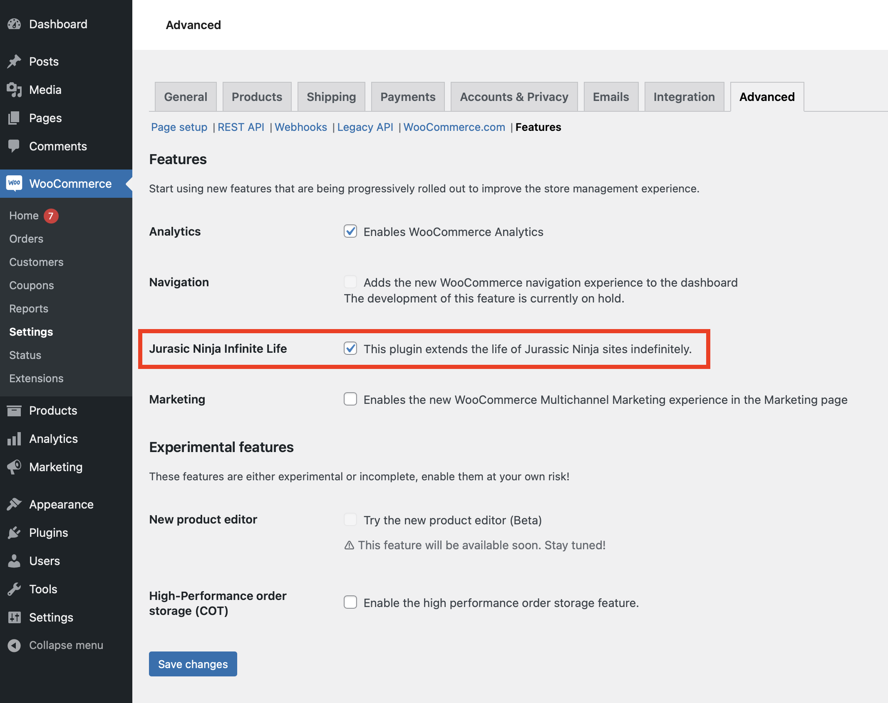

# Jurassic Ninja Infinite Life

This plugin indefinitely extends the life of your Jurassic Ninja site.

## Requirements

1. This needs to be running on a [Jurassic Ninja](https://jurassic.ninja) site.
2. WooCommerce is required to provide the settings page and the bundled ActionScheduler library.

## Setup

1. Install the plugin
2. Go to WooCommerce > Settings > Advanced > Features
3. Enable the "Jurassic Ninja Infinite Life" feature
4. Click "Save changes"

## How it works

This plugin utilizes [Action Scheduler](https://actionscheduler.org) (bundled with WooCommerce) to schedule an action every two days that extends the life of the Jurassic Ninja site.

When updates are released, they can be installed automatically by using the [Git Updater](https://github.com/afragen/git-updater/releases/latest) plugin.

## Available filters

### `jurassic_ninja_infinite_life_action_frequency`

Allows you to change how frequently the action is scheduled to change extend the site's life. The value is in seconds.

**Type:** `int`

**Default:** `172800` (2 days in seconds)
